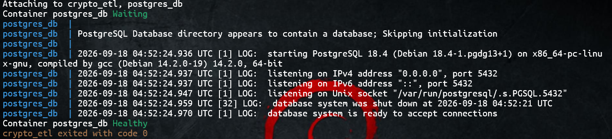
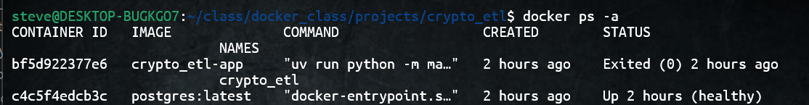
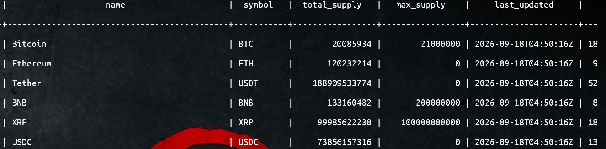

# Dockerized Crypto ETL Pipeline with CoinPaprika
## Contents
1. [Project Overview](#1-project-overview)
2. [Prerequisites](#2-prerequisites)
3. [Tech Stack](#3-tech-stack)
4. [Project Structure](#4-project-structure)
5. [Project Architecture](#5-project-architecture)
6. [Environment Setup](#6-environment-setup)
7. [Running Docker](#7-running-docker)

## 1. Project Overview
This project provides a Docker image for an ETL pipeline that extracts crypto data from the [CoinPaprika API](https://coinpaprika.com), transforms it into the desired structure, and loads the cleaned data into a PostgreSQL database running on docker.

## 2. Prerequisites
1. Install [docker engine](https://docs.docker.com/engine/install/ubuntu/)
2. Install [uv by Astral](https://docs.astral.sh/uv/getting-started/installation/)

## 3. Tech Stack
- Python
- CoinPaprika REST API
- Docker
- SQLAlchemy
- psycopg2
- pandas
- uv by Astral

## 4. Project Structure
```text
dockerized_crypto_etl
├── Dockerfile          #creates the ETL image
├── README.md           #project documentation
├── compose.yaml        #multi-container management
├── config.py           #environment configurations
├── etl
│   ├── __init__.py     #package initialization 
│   ├── extract.py      #crypto data extraction logic
│   ├── load.py         #database upload logic
│   └── transform.py    #cleaning and transformation logic
├── main.py             #ETL logic synchronization
├── pyproject.toml      #general dependencies
└── uv.lock             #specific dependencies
```
## 5. Project Architecture
The project contains 2 main sections:
1. ETL pipeline
2. Docker platform

### ETL pipeline
The pipeline contains 3 sub-sections
1. Extract
2. Transform
3. Load
#### Extract
This module extracts cryptocurrency data from the CoinPaprika API. It uses python's `requests` module to extract the desired resources from the API.
#### Transform
The extracted data is then structured and cleaned by implementing the `pandas` library, making it ready for storage.
#### Load
This module connects to the database defined inside the [Docker Compose](compose.yaml) file by implementing `SQLAlchemy` and the `psycopg2` driver. Pandas `to_sql` function uploads the cleaned data to the database.
### Docker Platform
This consists of 2 modules that define how the application will be packaged and organized in Docker. The 2 modules are:
1. [Dockerfile](Dockerfile)
2. [Docker Compose file](compose.yaml)
#### Dockerfile
This creates a docker image of the ETL pipeline.
#### Docker Compose file
It manages and runs both the pipeline's image and the PostgreSQL image as services. It defines the container names, environemnt variables, and the pipeline's dependency on the database.
### Genaral Structure:
```text
 ---------------
|CoinPaprika API|
 ---------------
      ⬇
 __________
|  Docker  |
|__________|
| Extract  |
|    ⬇     |
| Transform| 
|    ⬇     |
|   Load   |
|    ⬇     |
|----------|
| Database |
|----------|
|__________|
```
## 6. Environment Setup
### 1. Cloning the repository
Clone the git repository and switch to the project directory
```bash
$ git clone <repository name>
$ cd dockerized_crypto_etl
```
### 2. Configuration
Create  a .env file and copy paste the configuration details in [.env.example](.env.example) and replace the placeholder values with your own configurations.
```bash
$ touch .env
```
### 3. Synchronizing dependencies
Add all the dependencies in [uv.lock](uv.lock)
```bash
$ uv sync
```
## 7. Running Docker
### 1. Running docker compose
While still in the project directory, run `docker compose up` to start the docker images.
```bash
$ docker compose up
```
The command will return log details as below:
<div>

<figcaption align="center"><i>successful compose logs</i></figcaption>
</div>

### 2.Checking running docker containers
To check if the docker containers are up and running run `docker ps` or `docker ps -a`
```bash
$ docker ps -a
```
<div>

<figcaption align="center"><i>list of containers</i></figcaption>
</div>

### 3.Checking the Docker PostgreSQL database
If containers are running, navigate to the postgres container shell and view the table data uploaded by the ETL.
```bash
$ docker exec -it postgres_db psql -U <your_db_username>
```
```psql
username=#\c <your_crypto_database>
DB_name=# SELECT * FROM crypto_coins;
```
<div>

<figcaption align="center"><i>Crypto table<i/></figcaption>
</div>